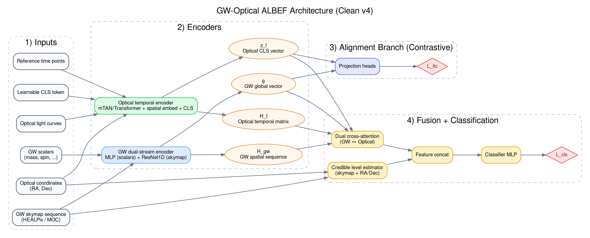

# ML+GW+KN 模型技术报告

本文基于仓库 `ML+GW+KN` 中与模型直接相关的源码撰写，重点解释主模型 `GWOpticalALBEFModel` 的结构、张量流向、损失函数和训练计算过程，并补充说明仓库中的光学-only 变体。本文只描述代码中可以直接验证的实现，不扩展到仓库之外的推断结果。

对应的核心源码文件包括：

- `Model/model.py`
- `Model/ALBEF_train.py`
- `Model/data_loader.py`
- `optical_only/train_optical_only.py`
- `optical_only/test_evaluate_optical_only.py`

可参考仓库中的结构图：



## 1. 模型基本结构

### 1.1 任务定义

仓库中的主模型面向两类相关任务：

1. **跨模态对齐任务**
   给定一个 GW 事件和一条光学光变曲线，判断它们在表征空间中是否对应同一物理事件。
2. **跨模态分类任务**
   在完成表征对齐后，进一步判断某个 GW-光学对是否为真实匹配对。

因此整体采用了典型的 **Align Before Fuse** 思路：

1. 先分别编码 GW 与光学数据；
2. 再在投影空间中做对比学习；
3. 最后在特征级别做跨模态融合分类。

### 1.2 输入与输出

主模型在训练时的主要输入张量如下。

| 名称 | 形状 | 含义 |
| --- | --- | --- |
| `gw_s` | `[B, 7]` | GW 标量参数，默认包括质量、自旋、倾角、距离统计量等 |
| `gw_m` | `[B, 7, 19200]` | GW MOC skymap 的 7 个通道 |
| `opt_coords` | `[B, 2]` | 光学源天球坐标 `(RA, Dec)` |
| `opt_t` | `[B, L]` | 光学观测时间序列 |
| `opt_v` | `[B, L, 6]` | 六个波段的 luptitude 值 |
| `opt_mask` | `[B, L, 6]` | 观测掩码，表示某时刻某波段是否有数据 |
| `opt_err` | `[B, L, 6]` | luptitude 误差 |
| `opt_ref_t` | `[B, N]` | 参考时间网格，默认 `N=64` |
| `gw_indices` | `[B]` | 每条光学样本对应的父 GW 事件索引 |

主模型的中间输出分为四部分：

- `g`：GW 全局向量
- `z_l`：光学全局 CLS 向量
- `h_l`：光学参考时间序列特征矩阵
- `H_gw`：GW skymap 的空间序列特征矩阵

最终输出包括：

- 对比学习分支的相似度矩阵 `sim_g2o`
- 分类分支的二分类 `logits`

### 1.3 总体前向计算

主模型的总体计算可概括为：

```text
输入:
  GW 标量 gw_s
  GW skymap gw_m
  光学时间序列 opt_t, opt_v, opt_mask, opt_err
  光学坐标 opt_coords

编码:
  g, H_gw = GWEncoder(gw_s, gw_m)
  z_l, h_l = OpticalEncoder(opt_coords, opt_t, opt_v, opt_ref_t, opt_mask, opt_err)

对比学习:
  feat_g = normalize(Proj_g(g))
  feat_o = normalize(Proj_o(z_l))
  sim_g2o = feat_g @ feat_o^T / T + time_bias
  L_itc 或 L_supcon

分类:
  logits = Fusion(g, h_l, z_l, H_gw, cred_level)
  L_cls = CrossEntropy(logits_pos, logits_hard, logits_extra_neg)

总损失:
  L_total = w_itc * L_itc + w_cls * L_cls
```

## 2. 数据表示与批构造

### 2.1 HDF5 关系型数据组织

`Model/data_loader.py` 中的 `RelationalHDF5Dataset` 采用关系型 HDF5 结构：

- `events/gw_data/*` 保存唯一的 GW 事件
- `events/optical_data/*` 保存光学 realization
- `events/optical_data/parent_gw_idx` 将每条光学曲线映射回其父 GW 事件

因此训练时，模型拿到的是“一条光变曲线 + 它对应的唯一 GW 事件”。

### 2.2 luptitude 光学输入

仓库在构建数据集时把 SNANA 输出的 `FLUXCAL/FLUXCALERR` 转换为 `psfFlux` 单位下的 luptitude。设：

- `ZP_fluxcal = 27.5`
- `ZP_psf = 31.4`
- `A = 2.5 / ln 10`

则先做零点转换：

```math
f_{\mathrm{psf}} = \mathrm{FLUXCAL} \cdot 10^{0.4(ZP_{\mathrm{psf}}-ZP_{\mathrm{fluxcal}})}
```

```math
\sigma_{\mathrm{psf}} = \mathrm{FLUXCALERR} \cdot 10^{0.4(ZP_{\mathrm{psf}}-ZP_{\mathrm{fluxcal}})}
```

再定义每个波段的 softening 参数：

```math
f_{5\sigma,b} = 10^{(ZP_{\mathrm{psf}} - m_{5,b})/2.5}
```

```math
b_b = k \cdot \frac{f_{5\sigma,b}}{5}
```

其中默认：

- `k = 1.0`
- `m5 = [23.9, 25.0, 24.7, 24.0, 23.3, 22.1]`，顺序为 `u,g,r,i,z,Y`

最终 luptitude 与误差为：

```math
m_{\mathrm{lupt}} = ZP_{\mathrm{psf}} - A \left[\operatorname{asinh}\left(\frac{f_{\mathrm{psf}}}{2b_b}\right) + \ln b_b\right]
```

```math
\sigma_{\mathrm{lupt}} = A \cdot \frac{\sigma_{\mathrm{psf}}}{\sqrt{f_{\mathrm{psf}}^2 + (2b_b)^2}}
```

因此，模型的光学输入不是原始 flux，而是：

- `opt_v`：六波段 luptitude
- `opt_err`：对应的 luptitude 误差

### 2.3 批采样策略

仓库为不同训练目标设计了不同采样器：

- `BalancedGWBatchedSampler`
  每个 batch 采样 `batch_size` 个不同 GW，每个 GW 只随机取一条光变。这样可以避免对比学习中同一 GW 的不同光变在同一 batch 里误当负样本。

- `MultiPositiveGWBatchedSampler`
  用于 `SupCon`。每个 batch 按 `samples_per_gw` 为同一 GW 采样多条光变，从而在 batch 内构造显式多正样本结构。

- `MixedGWBatchedSampler`
  用于包含负 GW 的设置。它在同一 batch 中混合：
  - 正 GW-光学配对
  - 负 GW 与随机光学的错配样本

这一设计与损失函数紧密耦合，是仓库实现中非常关键的工程细节。

## 3. 引力波编码器

GW 编码器有两个版本：

- `GWMOCResNetEncoder`
- `LightweightGWEncoder`

两者都采用双流结构：

1. 标量参数流：MLP
2. skymap 流：1D CNN / ResNet

### 3.1 输入表示

GW 输入包括：

- `gw_scalars`：默认 7 维标量特征
- `skymap_sequence`：形状 `[B, 7, 19200]`

在训练脚本的可信度估计函数 `compute_credible_level()` 中，7 个 skymap 通道按如下语义使用：

- 通道 0-2：像素中心方向的 `(x, y, z)`
- 通道 4：像素概率密度 `dP`

这说明 skymap 至少包含方向和概率信息，后续分类分支会直接使用这些通道显式计算空间相关性。

### 3.2 标量流

标准版和轻量版都使用两层 MLP：

```text
Linear -> BatchNorm -> ReLU -> Dropout -> Linear -> BatchNorm -> ReLU
```

其作用是把质量、自旋、距离统计量等低维物理量编码成隐藏表示 `h_scalar`。

### 3.3 skymap 流：标准版

标准 `GWMOCResNetEncoder` 内部使用 `ResNet1D`。其主要流程为：

```text
[B, 7, 19200]
 -> Conv1d(kernel=7, stride=4)  -> [B, 64, 4800]
 -> MaxPool1d(stride=2)         -> [B, 64, 2400]
 -> Layer1                      -> [B, 64, 2400]
 -> Layer2                      -> [B,128,1200]
 -> Layer3                      -> [B,256, 600]
 -> Layer4                      -> [B,512, 300]
 -> AdaptiveAvgPool1d(1)
 -> FC                          -> [B, 128]
```

该分支同时保留：

- `h_skymap`：池化后的全局向量
- `skymap_feat`：长度约为 300 的空间特征图

### 3.4 skymap 流：轻量版

`LightweightGWEncoder` 用更小的 1D CNN 替代 ResNet，适用于小样本 GW 训练场景。其 skymap 编码器 `LightweightSkymapEncoder` 使用三个卷积块：

```text
[B, 7, 19200]
 -> Conv1d(7->32, stride=4)   -> [B, 32, 4800]
 -> Conv1d(32->64, stride=4)  -> [B, 64, 1200]
 -> Conv1d(64->128, stride=4) -> [B,128, 300]
 -> AdaptiveAvgPool1d(1)
 -> Linear                    -> [B, 128]
```

轻量版仍然保留空间特征图，并通过 `1x1 Conv` 投影到融合分支所需的维度。

### 3.5 双流融合输出

无论标准版还是轻量版，GW 编码器最后都会输出：

- `g ∈ R^{B × d}`：全局向量，供投影头与分类分支使用
- `H_gw ∈ R^{B × M × d}`：空间序列特征，供双向交叉注意力融合使用

其中：

```math
g = \mathrm{FusionHead}([h_{\mathrm{scalar}}; h_{\mathrm{skymap}}])
```

## 4. 光学编码器

光学编码器是仓库的核心创新部分之一，由以下模块组成：

1. 可学习周期时间嵌入 `LearnablePeriodicEmbedding`
2. 坐标嵌入 `SpatialEmbedding`
3. `CLS` token 注入
4. `MultiTimeAttention`（mTAN 变体）

### 4.1 输入形式

光学编码器输入为：

- `opt_coords`：源坐标
- `opt_t`：不规则采样时间
- `opt_v`：六波段 luptitude
- `opt_mask`：每个时间-波段元素是否存在观测
- `opt_err`：每个时间-波段元素的 luptitude 误差
- `opt_ref_t`：参考时间序列

其中 `opt_t` 通常已经是经过时间零点归一化和缩放后的相对时间，例如：

```math
t_{\mathrm{rel}} = \frac{\mathrm{MJD} - t_0}{100}
```

`t_0` 的具体定义取决于数据集：

- 多模态主线：通常与父 GW 事件时间相关
- 光学-only 主线：通常是首次探测时间

### 4.2 可学习周期时间嵌入

对每个注意力头 `h`，时间嵌入定义为：

```math
\phi_h(t)[0] = w_{0h} t + a_{0h}
```

```math
\phi_h(t)[i] = \sin(w_{ih} t + a_{ih}), \quad 1 \le i < d_r
```

也就是说，每个头都包含：

- 一个线性项
- 若干可学习频率的正弦周期项

这使模型能够同时表示长期趋势与多尺度时间结构。

### 4.3 坐标嵌入

`SpatialEmbedding` 先把 `(RA, Dec)` 转成单位球坐标 `(x, y, z)`：

```math
x = \sin\theta \cos\phi,\quad
y = \sin\theta \sin\phi,\quad
z = \cos\theta
```

然后通过 MLP 投影到 `ref_dim`，再通过线性层展开为 `[H × d_r]` 维度，作为 `CLS token` 的空间条件项。

### 4.4 CLS token 的注入方式

`OpticalEncoderWithCLS` 并不是在输出端简单取平均，而是在查询端显式引入一个可学习的 `CLS token`：

```math
Q_{\mathrm{all}} = [q_{\mathrm{cls}} + e_{\mathrm{spatial}},\ \phi(t_{ref,1}),\ldots,\phi(t_{ref,N})]
```

因此查询矩阵包含两部分：

- 第 1 个位置：全局 `CLS` 查询
- 其余位置：参考时间点的局部查询

经过注意力后：

- 第 1 个输出向量作为全局表示 `z_l`
- 其余 `N` 个输出向量组成时间特征矩阵 `h_l`

### 4.5 Multi-Time Attention 数学公式体系

`MultiTimeAttention` 是光学编码器的核心计算模块。相较于原始 mTAN，本实现做了三项关键改进：**逐波段独立注意力分布**、**逆方差加权误差惩罚**、以及 **逐维度缺失掩码**。以下以严格公式描述完整计算过程。

#### 公式 (1)：可学习周期时间嵌入 $\phi_h(t)$

对每个注意力头 $h = 1, \ldots, H$，时间 $t$ 的嵌入定义为：

```math
\phi_h(t)[i] = \begin{cases} w_{0h} \cdot t + a_{0h} & \text{if } i = 0 \quad \text{(线性项)} \\ \sin(w_{ih} \cdot t + a_{ih}) & \text{if } 0 < i < d_r \quad \text{(周期项)} \end{cases}
```

其中频率 $w_{ih}$ 和相位 $a_{ih}$ 均为可学习参数。线性项捕获长期趋势，周期项覆盖多尺度时间结构。嵌入输出 $\phi_h(t) \in \mathbb{R}^{d_r}$。

#### 公式 (2)：带逆方差加权的维度特定注意力分数

原始 mTAN 在所有特征维度 $D$ 之间共享注意力分数。本实现将其扩展为 **逐波段独立计算**，并引入可学习的逆方差加权误差惩罚项。

对查询时刻 $t$（参考时间网格或 CLS token）、键时刻 $t_l$（观测时间）和波段 $d$，修正后的注意力对数分数为：

```math
\tilde{s}_h(t, t_l, d) = \frac{\big(\mathbf{W}\,\phi_h(t)\big)\big(\mathbf{V}\,\phi_h(t_l)\big)^\top}{\sqrt{d_k}} \;-\; \lambda \cdot \log\!\big(\sigma_{ld}^2 + \varepsilon\big)
```

其中：

- $\mathbf{W}, \mathbf{V} \in \mathbb{R}^{d_k \times d_r}$ 为可学习投影矩阵（线性层，无偏置）
- $\sigma_{ld}$ 为观测点 $t_l$ 在波段 $d$ 的 luptitude 测量误差
- $\lambda$ 为可学习标量参数（`lambda_param`），控制误差惩罚强度
- $\varepsilon = 10^{-9}$ 防止数值溢出

第一项是标准的缩放点积注意力；第二项 $-\lambda \log(\sigma^2)$ **使低误差观测自动获得更高的注意力权重**，等价于近似的逆方差加权。当 $\sigma_{ld}$ 小时，$-\log(\sigma^2)$ 为正值，提升该观测的权重；反之则抑制高噪声观测的贡献。

> 当未提供误差时（`errors=None`），公式退化为标准缩放点积注意力。

#### 公式 (3)：带缺失数据掩码的注意力权重

对未观测的波段–时间组合施加掩码（$m_{ld} = 1$ 表示波段 $d$ 在时刻 $t_l$ 有观测，$m_{ld} = 0$ 表示缺失）：

```math
\kappa_h(t, t_l, d) = \frac{m_{ld} \cdot \exp\!\big(\tilde{s}_h(t, t_l, d)\big)}{\displaystyle\sum_{l'=1}^{L} m_{l'd} \cdot \exp\!\big(\tilde{s}_h(t, t_{l'}, d)\big)}
```

即 softmax **仅在每个波段 $d$ 的有效观测时间点上归一化**。实现上，缺失位置的分数被设为 $-10^9$ 后统一做 softmax。这确保了：

- 每个波段拥有 **独立的注意力分布**
- 缺失观测（如某波段在某夜无数据）不参与加权

#### 公式 (4)：逐波段加权插值

每个注意力头 $h$ 对波段 $d$ 的插值值为：

```math
\hat{x}_{hd}(t) = \sum_{l=1}^{L} \kappa_h(t, t_l, d) \cdot x_{ld}
```

其中 $x_{ld}$ 为波段 $d$ 在时刻 $t_l$ 的观测值（luptitude 流量）。这一步将不规则采样的离散观测在参考时间网格上进行加权插值。

#### 公式 (5)：多头融合输出

将所有注意力头和波段的插值结果拼接后线性投影：

```math
\mathrm{mTAN}(t)[j] = \mathbf{U} \cdot \underset{h,d}{\mathrm{Concat}}\big[\hat{x}_{hd}(t)\big]
```

其中 $\mathbf{U} \in \mathbb{R}^{J \times (H \cdot D)}$ 将 $H \times D$ 维的拼接向量投影到输出空间 $\mathbb{R}^J$。

#### 公式 (6)：CLS 查询构造

查询序列由一个可学习 CLS token（融合空间坐标信息）和参考时间嵌入拼接而成：

```math
\mathbf{q}_0^{(h)} = \mathbf{e}_{\mathrm{cls}}^{(h)} + \mathrm{Proj}\!\big(\mathrm{SpatialMLP}(\mathrm{Sph}(\alpha, \delta))\big)^{(h)}
```

```math
\mathbf{q}_n^{(h)} = \phi_h(t_n^{\mathrm{ref}}), \quad n = 1, \ldots, N
```

其中 $\mathrm{Sph}(\alpha, \delta)$ 将赤经赤纬转为单位球笛卡尔坐标 $(x,y,z)$，经 MLP 投影后为 CLS token 注入空间位置信息。

### 4.6 相较于原始 mTAN 的改进总结

| 改进点 | 原始 mTAN | 本实现 |
| --- | --- | --- |
| 注意力分数 | 所有维度共享 $\kappa_h(t, t_l)$ | 逐波段独立 $\kappa_h(t, t_l, d)$ |
| 测量误差 | 未考虑 | 逆方差加权惩罚 $-\lambda\log(\sigma^2 + \varepsilon)$ |
| 缺失数据处理 | 简单 padding | 逐维度二值掩码 $m_{ld}$ |
| 时间嵌入参数 | 固定或部分可学习 | 频率 $w_{ih}$ 与相位 $a_{ih}$ 全部可学习 |
| 全局表示 | 无 | CLS token + 空间坐标嵌入 |
| 误差强度控制 | — | 可学习标量 $\lambda$ 自适应调节 |

### 4.7 光学编码器输出

`OpticalEncoderWithCLS` 的最终输出分为两部分：

- **全局表示** $\mathbf{z}_l = \mathrm{mTAN}(\mathbf{q}_0) \in \mathbb{R}^{J}$：CLS 位置的输出向量，用于对比对齐分支
- **时序表示** $\mathbf{H}_l = [\mathrm{mTAN}(\mathbf{q}_1), \ldots, \mathrm{mTAN}(\mathbf{q}_N)] \in \mathbb{R}^{N \times J}$：参考时间网格上的特征矩阵，用于跨模态融合分类分支

## 5. 对比学习分支

### 5.1 投影头

GW 与光学全局向量分别经过一个两层 MLP 投影头：

```math
\tilde{g} = \mathrm{Proj}_{gw}(g), \quad
\tilde{o} = \mathrm{Proj}_{opt}(z_l)
```

再做 `L2` 归一化：

```math
f_g = \frac{\tilde{g}}{\|\tilde{g}\|_2}, \quad
f_o = \frac{\tilde{o}}{\|\tilde{o}\|_2}
```

### 5.2 相似度计算与温度参数

相似度矩阵为：

```math
\mathrm{sim}_{g\to o} = \frac{f_g f_o^\top}{T}
```

其中温度 `T = exp(log_temp)`，并被限制在 `[temp_min, temp_max]` 范围内。

### 5.3 时间兼容惩罚项

代码中额外实现了一个时间兼容 bias，用于惩罚 GW 事件时间与光学时间零点明显不一致的配对：

```math
b_{ij} = -w \left(\frac{|t^{opt}_j - t^{gw}_i|}{\tau}\right)^p
```

然后裁剪到 `[-max_penalty, 0]`：

```math
\mathrm{sim}_{ij} \leftarrow \mathrm{sim}_{ij} + b_{ij}
```

这一项只会降低时间不一致配对的相似度，不会提高任何配对。

### 5.4 InfoNCE 版本

默认 InfoNCE 使用 batch 对角线作为正样本：

```math
L_{g2o} = \mathrm{CE}(\mathrm{sim}_{g\to o}, y)
```

```math
L_{o2g} = \mathrm{CE}(\mathrm{sim}_{o\to g}, y)
```

```math
L_{\mathrm{itc}} = \frac{L_{g2o}+L_{o2g}}{2}
```

如果启用 `mask_itc`，则同一 `gw_indices` 的样本会被视为多正样本，目标从 one-hot 变为按同事件归一化的软标签分布。

### 5.5 SupCon 版本

当 `itc_loss_type == "supcon"` 时，代码会把 `GW` 与 `Optical` 的投影特征拼接：

```math
F = [f_g; f_o] \in \mathbb{R}^{2B \times d}
```

标签也拼接为：

```math
y = [gw\_indices; gw\_indices]
```

然后构造正样本掩码：

- 只保留跨模态的同一事件配对
- 屏蔽同模态块与对角线

这使得同一 GW 的多条光变可以在一个 batch 中作为显式多正样本参与监督对比学习。

## 6. 分类分支

### 6.1 显式空间相关性：credible level

训练脚本 `ALBEF_train.py` 定义了 `compute_credible_level()`，用于显式衡量光学源位置在 GW skymap 中的可信度。

具体做法是：

1. 将光学源 `(RA, Dec)` 转为单位球向量；
2. 用 skymap 的 `(x,y,z)` 通道找到最近像素；
3. 读取该像素的 `dP`；
4. 计算“有多少像素的概率密度大于等于该值”。

因此：

```math
\mathrm{cred\_level} = \frac{1}{N_{pix}} \sum_{p} \mathbf{1}(dP_p \ge dP_{\mathrm{opt}})
```

这个量越小，说明光学源落在 GW skymap 的高概率区域；越大，说明位置越不相容。

### 6.2 单向与双向 Cross-Attention

分类头由 `CrossAttentionFusion` 实现。

#### 方向 1：GW 查询光学序列

```math
q_1 = W_q^{g\to o}(g)
```

```math
k_1 = W_k^{g\to o}(h_l), \quad v_1 = W_v^{g\to o}(h_l)
```

```math
f_{\mathrm{opt}} = \mathrm{LayerNorm}\left(\mathrm{softmax}\left(\frac{q_1 k_1^\top}{\sqrt{d}}\right) v_1\right)
```

这里：

- `query`：GW 全局向量 `g`
- `key/value`：光学时间特征矩阵 `h_l`

物理意义是：让 GW 事件在光学参考时间轴上检索与自己最一致的时间特征。

#### 方向 2：光学 CLS 查询 GW 空间特征（可选）

若启用 `dual_fusion=True`，分类头还会计算：

```math
q_2 = W_q^{o\to g}(z_l)
```

```math
k_2 = W_k^{o\to g}(H_{gw}), \quad v_2 = W_v^{o\to g}(H_{gw})
```

```math
f_{\mathrm{gw}} = \mathrm{LayerNorm}\left(\mathrm{softmax}\left(\frac{q_2 k_2^\top}{\sqrt{d}}\right) v_2\right)
```

这里：

- `query`：光学 CLS 向量 `z_l`
- `key/value`：GW skymap 空间特征 `H_gw`

物理意义是：让光学全局特征反向检索 GW 天图中的相关区域。

### 6.3 分类特征拼接

若 `dual_fusion=False`，分类器输入仅为：

```math
c = f_{\mathrm{opt}}
```

若 `dual_fusion=True`，则输入为：

```math
c = [f_{\mathrm{opt}}; f_{\mathrm{gw}}; \mathrm{cred\_level}]
```

这一步正是仓库中“特征融合 + 显式引入空间相关性”的实现。

### 6.4 MLP 输出 logits 与概率

分类器是两层 MLP：

```text
Linear -> ReLU -> Dropout -> Linear(2)
```

输出 `logits ∈ R^{B×2}`。训练时直接送入 `CrossEntropyLoss`；推理时可通过：

```math
p(y=1|x) = \mathrm{softmax}(\mathrm{logits})_{[:,1]}
```

得到匹配概率。

### 6.5 分类损失

分类分支会构造三类样本：

1. 正样本 `logits_pos`
2. batch 内错配 hard negatives `logits_hard`
3. 外部非 KN 暂现源 negatives `logits_neg`（如果提供负样本 HDF5）

总分类损失采用加权平均：

```math
L_{\mathrm{cls}} =
\frac{
w_{pos} L_{pos} + w_{hard} L_{hard} + w_{extra} L_{extra}
}{
w_{pos} + w_{hard} + w_{extra}
}
```

其中权重来自配置：

- `cls_pos_weight`
- `cls_neg_weight`
- `cls_extra_neg_weight`

## 7. 一次训练迭代中的完整计算流程

以下给出 `ALBEF_train.py` 中一次 batch 的主要计算流程。

### 7.1 构造参考时间网格

对当前 batch 生成固定长度参考时间序列：

```math
t_{ref} = \mathrm{linspace}(ref\_start, ref\_end, n\_ref)
```

默认设置通常为：

- `n_ref = 64`
- `ref_start = -0.3`
- `ref_end = 0.6`

### 7.2 编码主样本

```text
g, z_l, h_l, H_gw = model.encode(...)
```

得到：

- `g`：GW 全局表示
- `z_l`：光学 CLS 表示
- `h_l`：光学时间矩阵
- `H_gw`：GW 空间矩阵

### 7.3 计算对比学习损失

根据配置：

- 若 `itc_loss_type == "supcon"`，调用 `compute_supcon_loss()`
- 否则调用 `compute_itc_loss()`

并把可选的 `gw_event_time_mjd` 与 `opt_event_time_mjd` 传入，以计算时间兼容 bias。

### 7.4 计算正样本分类 logits

若启用双向融合，则先计算：

```text
cred_level = compute_credible_level(gw_m, opt_coords)
```

然后：

```text
logits_pos = model.fusion_logits(g, h_l, z_l=z_l, H_gw=H_gw, cred_level=cred_level)
```

### 7.5 构造 hard negatives

训练脚本支持三种负样本来源：

1. **easy negative**
   batch 内简单错位配对
2. **hard negative**
   从 `sim_g2o` 相似度矩阵中挑选最难负样本
3. **semi-hard negative**
   在正样本相似度附近的相似度带中采样错配光学

当存在 GW 事件时间信息时，脚本还会调用 `sample_inbatch_hard_negatives_with_time()`，优先在给定时间窗内选择时间上更容易混淆的错配样本。

对于选中的 hard negatives，脚本会重新编码错配光学曲线，并通过时间平移保留绝对不匹配关系：

```math
\Delta t = t^{opt}_{candidate} - t^{gw}_{anchor}
```

```math
t^{hard}_{shifted} = t^{hard} + \Delta t / s
```

其中 `s = neg_offset_scale_days_divisor`。

### 7.6 构造外部非 KN 负样本

如果提供了外部负样本数据集 `neg_data_path`，脚本还会读取非 KN 暂现源并编码：

```text
z_l_neg, h_l_neg = model.encode_optical(...)
logits_neg = model.fusion_logits(...)
```

若启用负样本时间偏移策略，则会对外部负样本的时间轴做多个 offset 版本，并在验证/评估时做 quantile ensemble。

### 7.7 合成总损失

最终：

```math
L_{\mathrm{total}} = w_{\mathrm{itc}} L_{\mathrm{itc}} + w_{\mathrm{cls}} L_{\mathrm{cls}}
```

其中：

- `w_cls` 可按 epoch 从 0 逐步 ramp 到目标值
- `w_itc` 可在训练后期衰减
- `hard_neg_ratio` 也可按 epoch 逐渐增大

因此训练是一个带有课程学习风格的联合优化过程，而不是从第一个 epoch 起就对所有目标施加同样强度的约束。

## 8. 推理与评估计算

仓库中的离线评估脚本 `Model/test_evaluate.py` 会在编码后分别计算：

1. `retrieval_batch`
2. `retrieval_gallery`
3. `classification`
4. `embedding`
5. `GW-shuffle` 消融

因此主模型在推理阶段既可以看作：

- 一个跨模态检索器
- 一个匹配对判别器

从实现上看，检索和分类共用同一套编码器，只是在输出头与评估指标上不同。

## 9. 光学-only 变体

除了主模型外，仓库还实现了 `OpticalKNClassifier`，用于不依赖 GW 输入的早期 kilonova 识别。

### 9.1 结构

光学-only 模型复用了无坐标版光学编码器 `OpticalEncoderWithCLSNoCoord`：

- 输入仍然是 `opt_t, opt_v, opt_ref_t, opt_mask, opt_err`
- 但不再注入空间坐标分支

随后：

```math
feat = [z_l ; \mathrm{mean}(h_l, dim=1)]
```

即把：

- CLS 全局向量 `z_l`
- 时间矩阵 `h_l` 的平均池化结果

拼接成一个联合表征，再送入二分类头。

### 9.2 预训练初始化

`optical_only/train_optical_only.py` 支持从多模态 ALBEF checkpoint 中加载光学编码器权重：

```text
model.load_optical_encoder_from_albef_state_dict(...)
```

这意味着光学-only 模型在工程上并不是完全独立设计，而是主模型光学表征的一种下游迁移。

### 9.3 universal 训练模式

如果启用 `universal_train_enable`，模型还会增加：

- `projection_head`
- `Gradient Reversal Layer`
- `adv_head_n_det`
- `adv_head_n_bands`
- `adv_head_t_span`

这些附加头用于：

- 双视图一致性约束
- 对 cadence 相关 nuisance variables 做对抗式去相关

其目的不是改变主分类头，而是减少模型对 `n_det / n_bands / t_span` 等观测模式捷径的依赖。

## 10. 总结

从代码实现看，`ML+GW+KN` 中的主模型可以概括为：

1. **GW 编码器**
   用 MLP + 1D CNN/ResNet 提取 GW 物理和空间特征，输出全局向量 `g` 和空间序列 `H_gw`。
2. **光学编码器**
   用带误差加权的 mTAN 对不规则 luptitude 序列建模，通过 `CLS token + 参考时间查询` 同时输出全局向量 `z_l` 和时间矩阵 `h_l`。
3. **对比学习分支**
   通过投影头、温度参数和时间兼容惩罚学习 GW 与光学全局表征的一致性。
4. **分类分支**
   通过单向或双向 Cross-Attention 融合 `g / h_l / z_l / H_gw / credible level`，输出配对分类 logits。
5. **训练机制**
   结合 batch 级采样、hard negative mining、时间偏移重编码和多损失加权调度，实现联合训练。

这一实现并不是简单的“两个编码器 + 一个分类头”，而是一个显式把 **时间不规则性、测量误差、天空空间一致性、难负样本和多任务训练调度** 都编码进来的完整跨模态系统。
